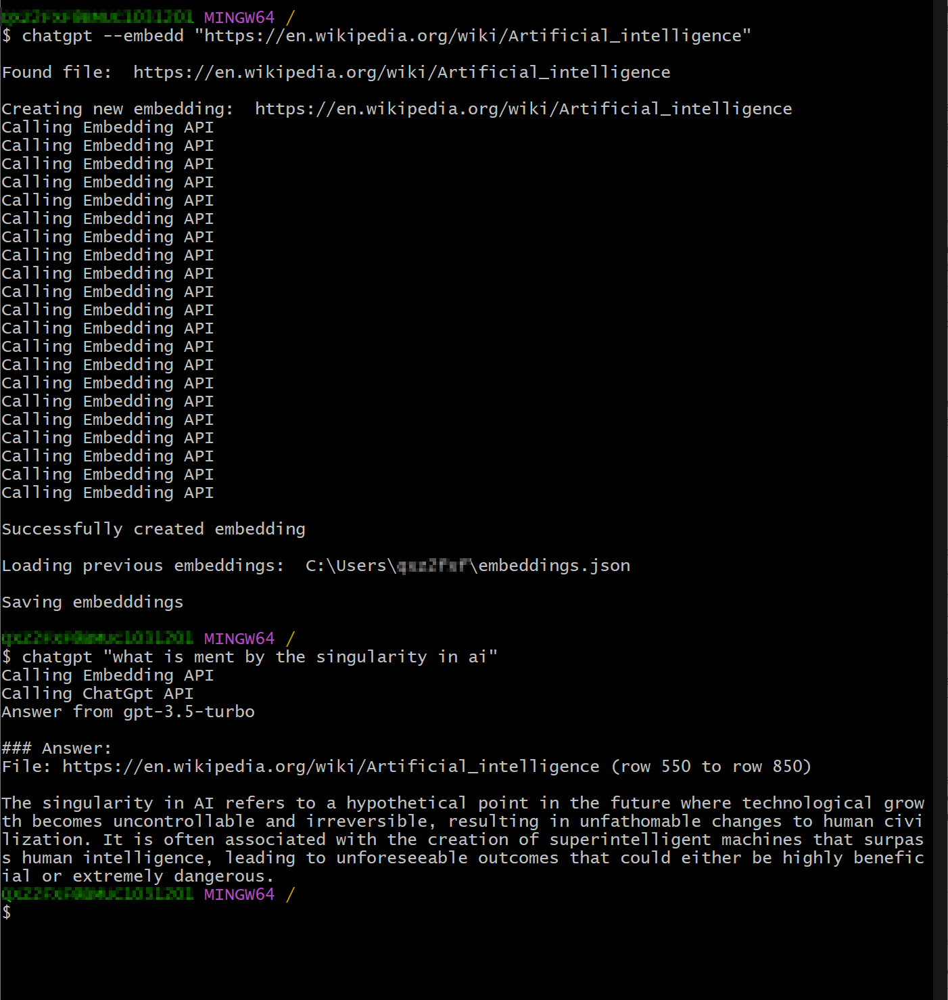

# ChatGpt Tool

This tool extends ChatGpt Api such that you can load any file, folder of website as context to ChatGpt. Anything you add is then memorised by the AI. This way you can teach ChatGpt your local domain knowledge and personalize it to your individual use cases.

1. Compile program: `go build -o chatgpt chatgpt.go`
2. Add program to your Path variable
3. Add OpenAi key: `chatgpt --key <YOUR-KEY>`
4. Add an embedding: `chatgpt --embedd <YOUR FILE/FOLDER/WEBSITE PATH>`
5. Start chatting: `chatgpt "your chat message goes here"`

